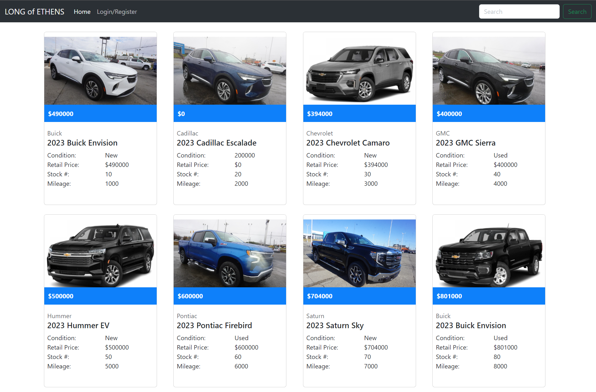
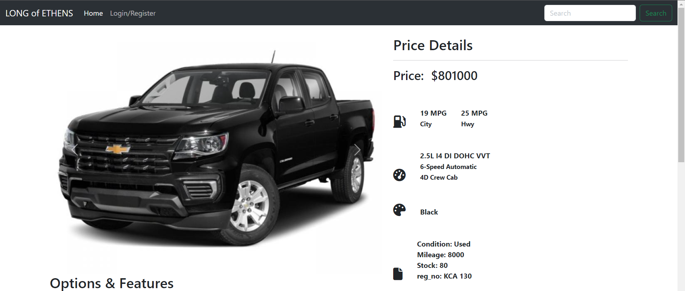
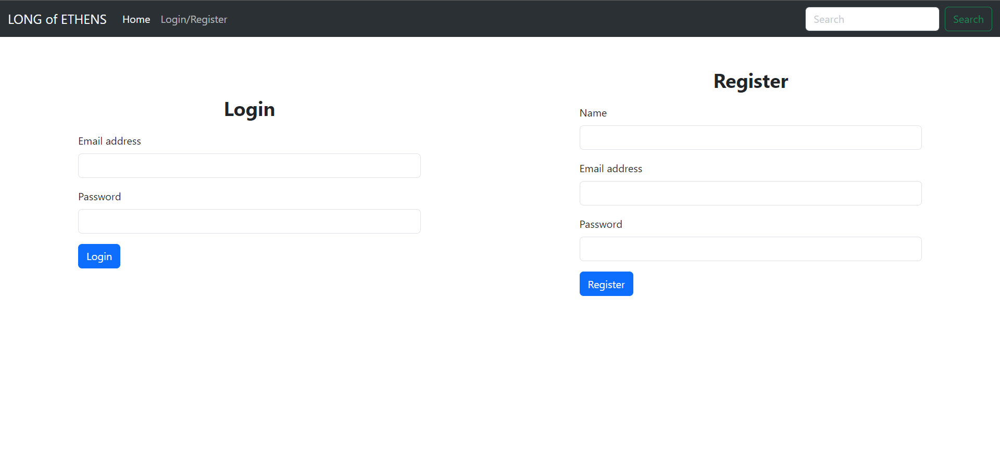

# PHP Assessment

## Technologies
List of technologies used within the project:
* [PHP](https://www.php.net/): Version 8.0.25
* [Bootstrap](https://getbootstrap.com/): Version 5.3.0
* [Database](https://www.mysql.com/): Version 8.0.25

<br>

## Setup
To run this project locally, first clone the repository:

Now for database setup, update the values in conn/index.php with your database credentials.

Then to create the tables and insert some dummy data, run the following route:

```
http://localhost/php-assessment/database/index.php
```

Now you can run the project by running the following route:

```
http://localhost/php-assessment/index.php
```
<br>

## Features
List of features ready
* User can register
* User can login
* User can logout
* User can view all cars listed
* User can view a single car
* If user is logged in, when viewing a single car, that car will be added to recently viewed cars

<br>

## Screenshots

### Home Page


<br>

### Details Page


<br>

### Authentication Page

